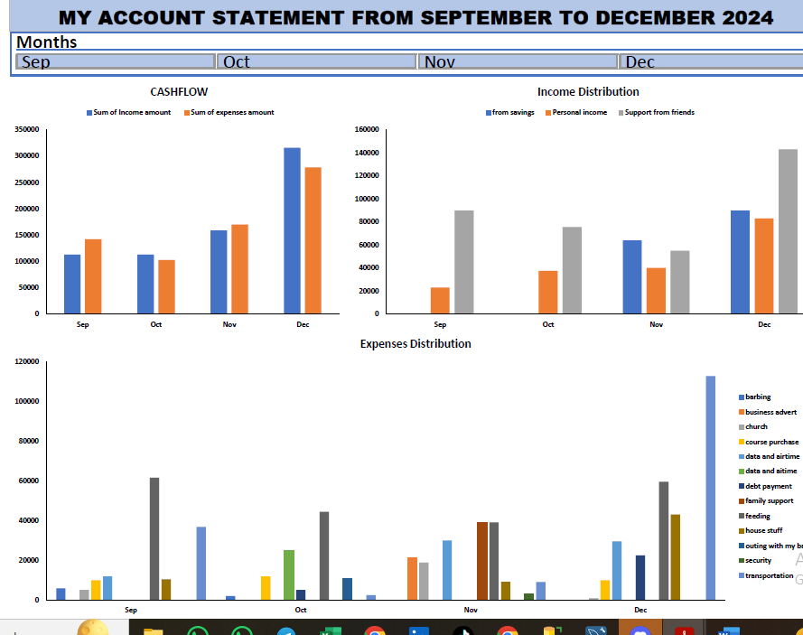

# MY FINANCIAL STATEMENT ANALYSIS FOR SEPTEMBER TO DECEMBER 2024
I decided to tell a story about my finances last year as a data analyst.
One of my decisions last year was to keep a record of all my cash flow. I tried many times and failed. I decided to learn and grow through the process. Today, I am happy that I have become conscious about putting down all my financial activities, no matter how small.
Today, I decided to analyze the last 4 months of 2024.

**[DATASET AND ANAYLSIS](my-account-analysis.xlsx)**

## DATA EXPLORATION PROCESS
1. I recorded all inflows and outflows of money and thereafter categorized them accordingly in Excel
2. Cleaned the dataset and prepared it for analysis
3. Since the dataset is small, I used Pivot Table for my analysis
4. Also created a dashboard using Pivot Table and Charts 

### MY FINANCIAL STATEMENT DASHBOARD.
****

## INSIGHTS I UNCOVERED:
1. Almost all my income went into expenses, including part of my life savings
2. I spent so much on data subscription for browsing, with not much income generated from the data
3. Transportation took so much from me.
4. It is good to have good friends who can always support you in your lowest moment
5. I invested in myself so much that it caused noticeable growth in my income

## SOME ADVICE I GAVE TO MYSELF:
1. Reduce your spending
2. Save more money for future investments
3. Increase your income flow and sources
4. My savings are not for expenses.
5. Family is everything

